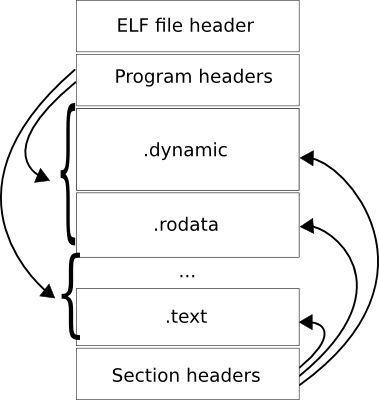
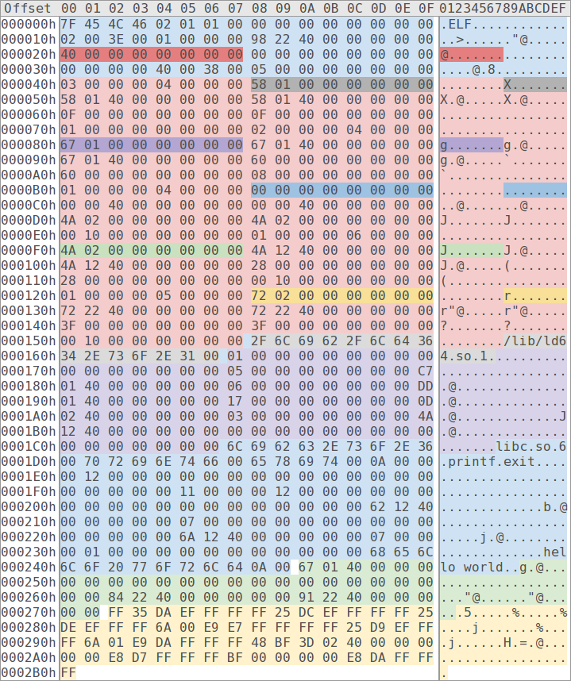

# The Anatomy of an Executable

The representation of executables, shared libraries and relocatable object code is standardized by a variety of file formats which provides encapsulation of assembly instructions and data. Two such formats are the Portable Executable (PE) file format and the Executable and Linkable Format (ELF), which are used by Windows and Linux respectively. Both of these formats partition executable code and data into sections and assign appropriate access permissions to each section, as summarised by table 1. In general, no single section has both write and execute permissions as this could compromise the security of the system.

|Section name | Usage description     | Access permissions|
|-------------|-----------------------|-------------------|
|`.text`      | Assembly instructions | `r-x`             |
|`.rodata`    | Read-only data        | `r--`             |
|`.data`      | Data                  | `rw-`             |
|`.bss`       | Uninitialized data    | `rw-`             |

Table 1: A summary of the most commonly used sections in ELF files. The `.text` section contains executable code while the `.rodata`, `.data` and `.bss` sections contains data in various forms.

To gain a better understanding of the anatomy of executables the remainder of this section describes the structure of ELF files and presents the dissection of a simple _"hello world"_ ELF executable, largely inspired by Eric Youngdale's article on _[The ELF Object File Format by Dissection](http://www.linuxjournal.com/article/1060)_. Although the ELF and PE file formats differ with regards to specific details, the general principles are applicable to both formats.

In general, ELF files consist of a file header, zero or more program headers, zero or more section headers and data referred to by the program or section headers, as depicted in figure 1.



Figure 1: The basic structure of an ELF file.

All ELF files starts with the four byte identifier `0x7F`, `'E'`, `'L'`, `'F'` which marks the beginning of the ELF file header. The ELF file header contains general information about a binary, such as its object file type (executable, relocatable or shared object), its assembly architecture (x86-64, ARM, …), the virtual address of its entry point which indicates the starting point of program execution, and the file offsets to the program and section headers.

Each program and section header describes a continuous segment or section of memory respectively. In general, segments are used by the linker to load executables into memory with correct access permissions, while sections are used by the compiler to categorize data and instructions. Therefore, the program headers are optional for relocatable and shared objects, while the section headers are optional for executables.



Figure 2: The entire contents of a simple _"hello world"_ ELF executable with colour-coded file offsets, sections, segments and program headers. Each file offset is 8 bytes in width and coloured using a darker shade of its corresponding segment, section or program header.

To further investigate the structure of ELF files a simple 64-bit _"hello world"_ executable has been dissected and its content colour-coded. Each file offset of the executable consists of 8 bytes and is denoted in figure 2 with a darker shade of the colour used by its corresponding target segment, section or program header. Starting at the middle of the ELF file header, at offset `0x20`, is the file offset (red) to the program table (bright red). The program table contains five program headers which specify the size and file offsets of two sections and three segments, namely the `.interp` (gray) and the `.dynamic` (purple) sections, and a _read-only_ (blue), a _read-write_ (green) and a _read-execute_ (yellow) segment.

Several sections are contained within the three segments. The _read-only_ segment contains the following sections:

* `.interp`: the interpreter, i.e. the linker
* `.dynamic`: array of dynamic entities
* `.dynstr`: dynamic string table
* `.dynsym`: dynamic symbol table
* `.rela.plt`: relocation entities of the PLT
* `.rodata`: read-only data section

The _read-write_ segment contains the following section:

* `.got.plt`: Global Offset Table (GOT) of the PLT (henceforth referred to as the GOT as this executable only contains one such table)

And the _read-execute_ segment contains the following sections:

* `.plt`: Procedure Linkage Table (PLT)
* `.text`: executable code section

Seven of the nine sections contained within the executable are directly related to dynamic linking. The `.interp` section specifies the linker (in this case _"/lib/ld64.so.1"_) and the `.dynamic` section an array of dynamic entities containing offsets and virtual addresses to relevant dynamic linking information. In this case the dynamic array specifies that _"libc.so.6"_ is a required library, and contains the virtual addresses to the `.dynstr`, `.dynsym`, `.rela.plt` and `.got.plt` sections. As noted, even a simple _"hello world"_ executable requires a large number of sections related to dynamic linking. Further analysis will reveal their relation to each other and describe their usage.

The dynamic string table contains the names of libraries (e.g. _"libc.so.6"_) and identifiers (e.g. _"printf"_) which are required for dynamic linking. Other sections refer to these strings using offsets into `.dynstr`. The dynamic symbol table declares an array of dynamic symbol entities, each specifying the name (e.g. offset to _"printf"_ in `.dynstr`) and binding information (local or global) of a dynamic symbol. Both the `.plt` and the `.rela.plt` sections refers to these dynamic symbols using array indicies. The `.rela.plt` section specifies the relocation entities of the PLT; more specifically this section informs the linker of the virtual address to the `.printf` and `.exit` entities in the GOT.

To reflect on how dynamic linking is accomplished on a Linux system lets review the assembly instructions of the executable `.text` and `.plt` sections as outlined by figure 3 and 4 respectively.

```asm
text:
  .start:
        mov     rdi, rodata.hello
        call    plt.printf
        mov     rdi, 0
        call    plt.exit
```

Figure 3: The assembly instructions of the `.text` section.

```asm
plt:
  .resolve:
        push        [got_plt.link_map]
        jmp         [got_plt.dl_runtime_resolve]
  .printf:
        jmp         [got_plt.printf]
  .resolve_printf:
        push        dynsym.printf_idx
        jmp         .resolve
  .exit:
        jmp         [got_plt.exit]
  .resolve_exit:
        push        dynsym.exit_idx
        jmp         .resolve
```

Figure 4: The assembly instructions of the `.plt` section.

As visualized in figure 3 the first call instruction of the `.text` section targets the `.printf` label of the `.plt` section instead of the actual address of the _printf_ function in the _libc_ library. The Procedure Linkage Table (PLT) provides a level of indirection between call instructions and actual function (procedure) addresses, and contains one entity per external function as outlined in figure 4. The `.printf` entity of the PLT contains a jump instruction which targets the address stored in the `.printf` entity of the GOT. Initially this address points to the next instruction, i.e. the instruction denoted by the `.resolve_printf` label in the PLT. On the first invokation of _printf_ the linker replaces this address with the actual address of the _printf_ function in the _libc_ library, and any subsequent invokation of _printf_ will target the resolved function address directly.

This method of external function resolution is called lazy dynamic linking as it postpones the work and only resolves a function once it is actually invoked at runtime. The lazy approach to dynamic linking may improve performance by limiting the number of symbols that require resolution. At the same time the eager approach may benefit latency sensitive applications which cannot afford the cost of dynamic linking at runtime.

A closer look at the instructions denoted by the `.resolve_printf` label in figure 4 reveals how the linker knows which function to resolve. Essentially the _dl_runtime_resolve_ function is invoked with two arguments, namely the dynamic symbol index of the _printf_ function and a pointer to a linked list of nodes, each refering to the `.dynamic` section of a shared object. Upon termination the linked list of our _"hello world"_ process contains a total of four nodes, one for the executable itself and three for its dynamically loaded libraries, namely _linux-vdso.so.1_, _libc.so.6_ and _ld64.so.1_.

To summarise, the execution of a dynamically linked executable can roughly be described as follows. Upon execution the kernel parses the program headers of the ELF file, maps each segment to one or more pages in memory with appropriate access permissions, and transfers the control of execution to the linker (_"/lib/ld64.so.1"_) which was loaded in a similar fashion. The linker is responsible for initiating the addresses of the _dl_runtime_resolve_ function and the aforementioned linked list, both of which are stored in the GOT of the executable. After this setup is complete the linker transfers control to the entry point of the executable, as specified by the ELF file header (in this case the `.start` label of the `.text` section). At this point the assembly instructions of the application are executed until termination and external functions are lazily resolved at runtime by the linker through invokations to the _dl_runtime_resolve_ function.

## Public domain

The source code and any original content of this repository is hereby released into the [public domain].

The [original version](https://en.wikipedia.org/wiki/File:Elf-layout--en.svg) of `elf_structure.png` is licensed [CC-BY].

[public domain]: https://creativecommons.org/publicdomain/zero/1.0/
[CC-BY]: https://creativecommons.org/licenses/by/4.0/
